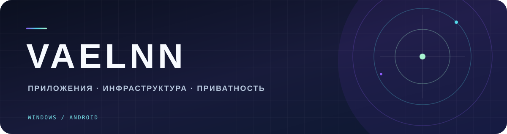

  

<h1 align="center">Привет, я VaelNN 👋</h1>

  Создаю приложения для Windows и Android. 
  Сейчас развиваю <a href="https://github.com/VaelNN/HateVPN"><strong>HateVPN</strong></a> — личный VPN-клиент для подписок и собственных серверов.

---

### ◈ Главный проект

**[HateVPN](https://github.com/VaelNN/HateVPN)** — клиент для Windows и Android с поддержкой подписок, собственного VPS и приглашений для друзей.

| Windows | Android | Свой сервер |
| :--- | :--- | :--- |
| Приложение и установщик; работа в трее, автозапуск и диагностика | Фоновая VPN-служба и управление из уведомления | Импорт конфигурации и приглашения с отдельным профилем |

[Исходный код и документация →](https://github.com/VaelNN/HateVPN) · [Релизы →](https://github.com/VaelNN/HateVPN/releases)

### ◈ Технологии проекта

`C#` · `.NET` · `WPF` · `Flutter` · `Dart` · `Kotlin`

### ◈ Сейчас в работе

Развиваю HateVPN для небольшой группы пользователей: улучшаю клиенты, подключение к собственному серверу и повседневный опыт использования.

  Есть идея или нашли проблему? <a href="https://github.com/VaelNN/HateVPN/issues">Откройте issue в HateVPN</a>.

